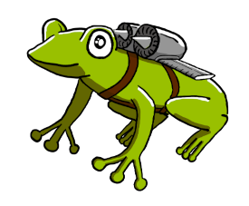

# frog-engine

    
    <!--  -->

Simple game engine in C++. Originally made as a project assignment.

Link to the original repository [pa199-project](https://gitlab.fi.muni.cz/xbrablik/pa199-project)

## Development tracking

- [Devlog](devlog.md)

- [TODO](TODO.md)

## Table of contents

[[_TOC_]]

## Folder structure:

### 1. Engine

- `./engine/`
    the whole engine

- `./engine/src/`
    the engine source files

- `./engine/tests/`
    tests for linear algebra calculations

- `./engine/docs/`
    generated documentation using Doxygen, see
    `./engine/docs/html/index.html`

- `./engine/libraries/`
    contains a folder for each additional library used by the engine

    - `GLFW/` (https://www.glfw.org/)
    - `glad/` (https://glad.dav1d.de/)
    - `stb_image/` (https://github.com/nothings/stb/blob/master/stb_image.h)
    - `tiny_obj_loader/` (https://github.com/tinyobjloader/tinyobjloader)
    - `catch2/` (https://github.com/catchorg/Catch2)
 

- `./engine/assets/`
    the engine assets such as shaders and font atlas

### 2. Game

- `./src/`
    source files of the game

- `./game_assets/`
    textures used in the game

- `./bin-win/Game.exe` and `./bin-lin/Game`
    the resulting compiled game for Windows and Linux respectively

- `./out/build/x64-Debug/Debug/Game.exe`
    the resulting compiled game for Windows when compiled in Visual Studio

## Notes

1. The engine is wrapped in the namespace `frog` and individual
    components are separated into nested namespaces:

    - `frog` - core engine part
    - `frog::geo` - geometry & maths: matrix, vector, etc.
    - `frog::gl` - graphics stuff: rendering, mesh, mesh generation
    - `frog::os` - system stuff: window creation, events handling
 

2. **Font** in `./engine/assets/font.png` is based off of **my own font** from
    [this repository](https://github.com/Bleskocvok/project_jumpy_tanx/blob/main/models/beautifont.png)

3. The architecture used for the engine is inspired by Unity:
    - the engine follows this structure:
    `engine` -> `scene_manager` -> `scene` -> `game_object` -> `script`

## Build instructions

### Windows

#### a. Using Visual Studio 🤮

- It should **just work** in VS 2019 (the C++ VS
    components need to be installed in VS Installer)

- Make sure to launch the target `Game.exe`

#### b. Using command line

1. Install necessary tools: `cmake`, `mingw64`

2. In `PowerShell`, enter the root folder of the project;
    If you perform the `ls` command, you should see files
    such as `CMakeLists.txt`, `README.md`, `engine/`, ...

3. Make sure the folder `bin-win` is empty

4. Call `script/build.bat`

5. Pray that it works; if not, return to step 1. and try to reconfigure
    the installation of `cmake` or `mingw`

6. If it worked, after it has finished you should be able to open
    `bin-win/Game.exe`, which starts the game

### Linux (Ubuntu)

1. Install `cmake` and `gcc`/`clang`

2. Install these packages and hope that it covers all
    necessary dependencies:
    - `sudo apt install libgl1-mesa-dev`
    - `sudo apt install mesa-common-dev`
    - `sudo apt install libxrandr-dev libxinerama-dev libxcursor-dev libxi-dev`
 

3. In `shell` enter the root folder of the project;
    If you perform the `ls` command, you should see files
    such as `CMakeLists.txt`, `README.md`, `engine/`, ...

4. Call `script/build.sh`

5. After it has finished you should be able to execute `bin-lin/Game`,
    which starts the game
